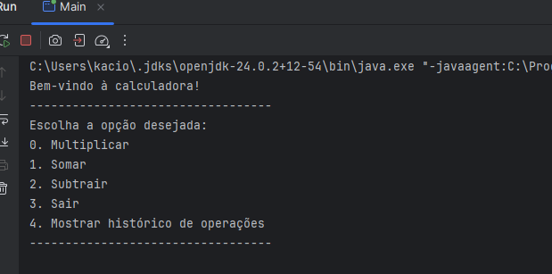

# Calculadora Orientada a Objetos em Java

## Sobre o projeto
Este projeto é uma **calculadora desenvolvida em Java** utilizando os princípios da **Programação Orientada a Objetos (POO)**. O objetivo é colocar em prática conceitos de **encapsulamento, modularização, reuso de código e estruturas de dados**, criando um software funcional, organizado e escalável.




---

## Funcionalidades
- Operações básicas: soma, subtração, multiplicação e divisão.
- Histórico de operações realizadas usando `ArrayList`.
- Código modularizado com classes separadas para números e operações.
- Uso de **getters** e **setters** para reforçar boas práticas de encapsulamento.
- Estrutura clara que facilita manutenção e expansão futura.

---

## Tecnologias
- **Java 11+**
- Estruturas de dados: ArrayList
- Paradigma: Programação Orientada a Objetos (POO)

---

## Conceitos de POO aplicados
- **Encapsulamento:** proteção de dados por meio de getters e setters.
- **Modularização:** código dividido em classes com responsabilidades claras.
- **Reuso e organização:** métodos e classes que podem ser aproveitados em outros projetos.
- **Estruturas de dados:** uso de `ArrayList` para registrar o histórico de operações.

---

## Como executar
1. Clone o repositório:
```bash
git clone https://github.com/EdCavalcante/calculadora-java


